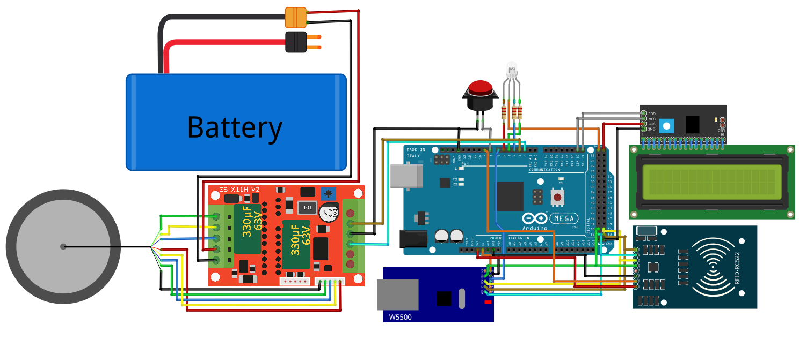

# 🚂 RailCarRFID

**RailCarRFID** es un proyecto de automatización para controlar **vagones autónomos** equipados con **Arduino Mega**, **motor DC** y un **lector RFID** 📡.
Cada vagón recibe una **etiqueta destino** por **interfaz serial**, se desplaza de forma controlada y valida su posición en tiempo real.

---

## 🎯 Objetivo

* 📍 Determinar la **dirección de giro** del motor DC (adelante/atrás).
* ⚙️ Controlar la **velocidad** mediante **PWM** para arranques y paradas suaves.
* 🕵️‍♂️ Monitorizar continuamente **etiquetas RFID** (MFRC522) para validar la **secuencia correcta**.
* ✅ Mostrar **“Posición alcanzada”** en la **pantalla LCD** al llegar al destino.
* ❌ Detectar errores de salto de etiqueta (no consecutiva), encender **LED RGB en rojo** y enviar mensaje de error por **serial**.

---

## 🔌 Componentes

| Componente             | Descripción                                          |
| ---------------------- | ---------------------------------------------------- |
| 🧩 **Arduino Mega**    | Controlador principal del vagón                      |
| ⚡ **Motor DC**         | Motor de tracción lineal                             |
| 🎛️ **Control PWM**    | Señal PWM para velocidad y arranque/parada suaves    |
| 📟 **Pantalla LCD**    | Para mostrar estados (“Posición alcanzada”, errores) |
| 🌈 **LED RGB**         | Indicador de estado (verde=OK, rojo=Error)           |
| 📡 **MFRC522 (RFID)**  | Lector de etiquetas RFID vía SPI                     |
| 🔌 **Interfaz Serial** | Recibe orden de destino y envía reportes de estado   |

---

## 🛠️ Diagrama de Conexiones

```
Arduino Mega        MFRC522 RFID     Motor Driver    LCD Display    LED RGB
-------------       -------------     ------------    -----------    -------
SPI MOSI (51) ---> MOSI              IN1/IN2         RS, E, D4-D7    R/G/B pins
SPI MISO (50) <--- MISO              PWM pin 6       VCC, GND       GND common
SPI SCK  (52) ---> SCK               ENA             5 V power      220 Ω resistors
SS      (53) ---> SDA               VCC              VCC            VCC
GND     ---> GND                                        
5 V      ---> VCC                                        
```


---

## 💾 Instalación

1. Clona este repositorio

   ```bash
   git clone https://github.com/tu_usuario/RailCarRFID.git
   ```
2. Abre el proyecto en el **Arduino IDE**.
3. Instala la librería **MFRC522** (Manage Libraries → “MFRC522” by GithubCommunity).
4. Conecta tu **Arduino Mega** y selecciona la placa y puerto correctos.
5. Sube el sketch `RailCarRFID.ino`.

---

## 🚀 Uso

1. Envía por serial la **etiqueta destino** (por ejemplo: `TAG_05`).
2. El vagón arranca, avanza/retrocede controlando velocidad con PWM.
3. Lee cada etiqueta en la vía; si la secuencia es correcta, sigue avanzando.
4. Al llegar a la **etiqueta destino**, detiene el motor y muestra “Posición alcanzada” en LCD ✅.
5. Si detecta un salto de etiqueta, enciende LED RGB rojo y emite “ERROR: Secuencia” por serial ❌.

---

## 📈 Validación y Estados

| Estado              | Indicador LCD        | LED RGB | Serial Output            |
| ------------------- | -------------------- | ------- | ------------------------ |
| Arranque/Movimiento | “Moviendo a TAG\_XX” | Verde   | `MOV: TAG_XX`            |
| Posición alcanzada  | “Posición alcanzada” | Verde   | `DONE: TAG_XX`           |
| Error de secuencia  | “Error: Secuencia”   | Rojo    | `ERROR: Secuencia salto` |

---

## 🤝 Contribuciones

¡Contribuye con mejoras, nuevas funciones o correcciones!

1. Haz un *fork* del repositorio.
2. Crea una rama (`git checkout -b feature/nueva-funcion`).
3. Realiza tus cambios y haz *commit* (`git commit -m "Añade …"`).
4. Sube tu rama (`git push origin feature/nueva-funcion`).
5. Abre un **Pull Request**.

---

## 📄 Licencia

Este proyecto está bajo la licencia **MIT**. Consulta el archivo `LICENSE` para más detalles.
